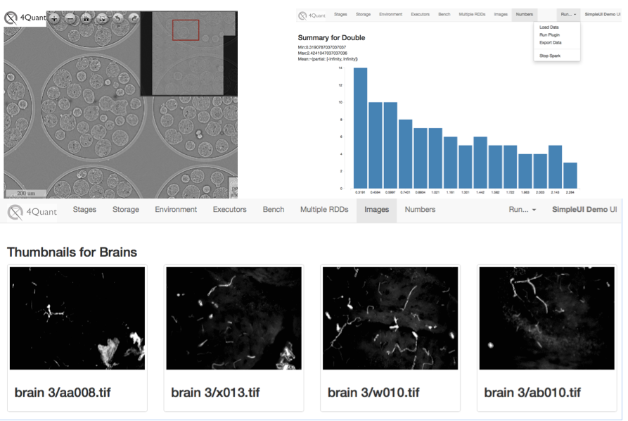

# Interactive Scientific Image Analysis and Analytics using Spark
The presentation and related material for the Spark East Summit (http://spark-summit.org/east/2015/agenda). The [slides]( are 

## ABSTRACT 
Many important scientific questions ranging from the micro-scale mechanical behavior of foam structures to the process of viral infection in cells demand not only high spatial, but also temporal resolution. Detector improvements have made realizing many of these experiments possible, and have consequently produced a flood of rich image data. At the TOMCAT beamline of the Swiss Light Source peak acquisition rates reach 8GB/s [1] and frequently cumulate to 10s or 100s of terabytes per day. While visual inspection is invaluable, detailed quantitative analysis is essential for summarizing and comparing samples and performing hypothesis tests. Even more important is the ability to detect outlier events and unexpected structures buried deep inside the voluminous data. Existing tools scale poorly beyond single computers and make this type of interactive exploration very difficult and time consuming. We have developed a scalable framework based on Apache Spark and the Resilient Distributed Datasets proposed in [2] for parallel, distributed, real-time image processing and quantitative analysis [3]. The distributed evaluation tool performs filtering, segmentation and shape analysis enabling data exploration and hypothesis testing over millions of structures with the time frame of an experiment. The tools have been tested with clusters containing thousands of machines and images containing more than 100 billion voxels. Furthermore we have expanded this tool using technologies like OpenLayers [4] and D3.js [5] to make the analysis reachable to even non-technical users. We show how these tools can be used to answer long-standing questions and see small genetically driven structural changes in bone, topology rearrangements in liquid foam, and track the course of infection in living cells. We finally demonstrate our future road map including real-time image processing using Spark Streaming and approximate analysis using BlinkDB. 
 
(Upper Left) A large 3D sample displayed in montage format to allow exploration without loading the entire dataset (Upper Right) shows basic statistics on intensity distribution in slices. (Bottom) Shows a view of many different datasets so they can be compared on the same screen.

## BIO
Kevin Mader is a lecturer in the X-ray Microscopy Group within the Department for Information Technology and Electrical Engineering at ETH Zurich. His research focuses on turning big hairy 3D images into simple, robust, reproducible numbers without resorting to black boxes or magic. In particular, as part of several collaborations, he is currently working on automatically segmenting full animal zebrafish images, characterizing rheology in 3D flows, and measuring viral infection dynamics in cell lines.